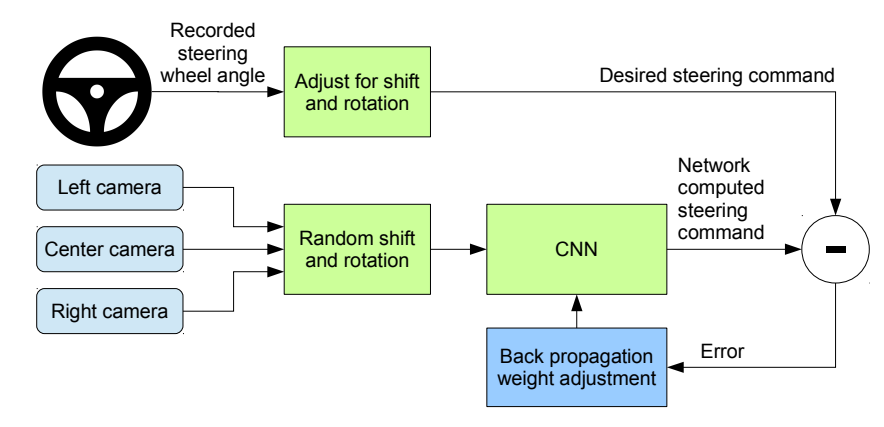
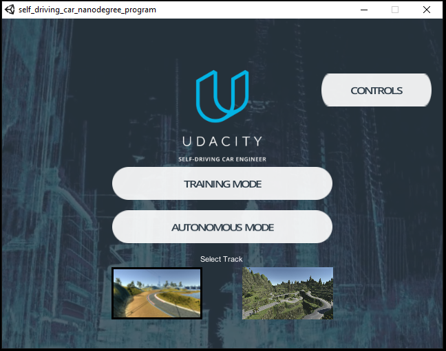
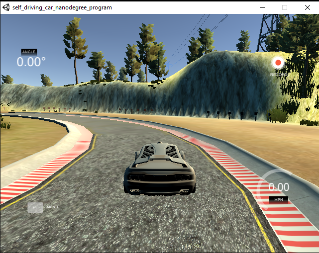
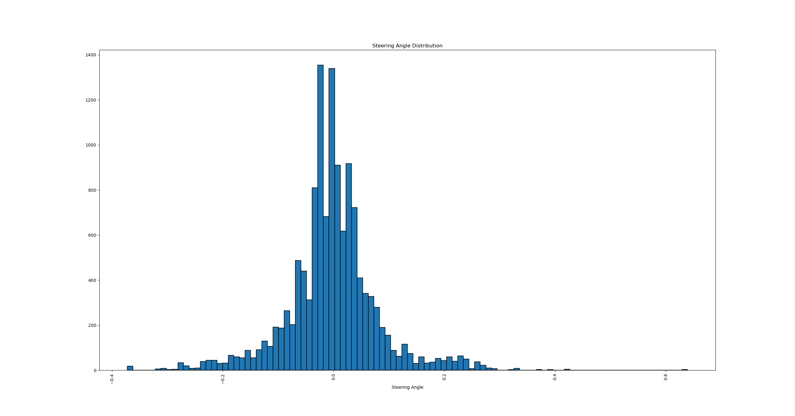
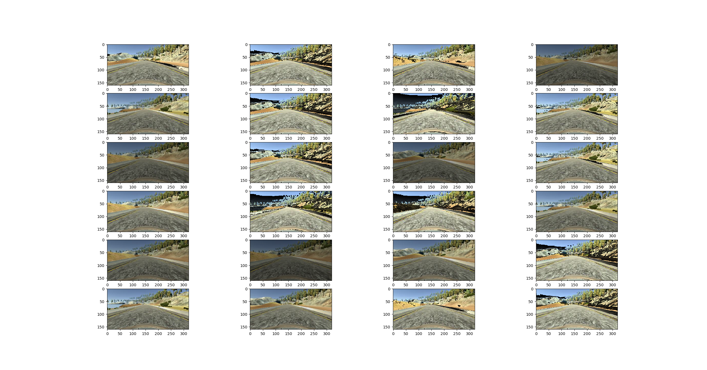
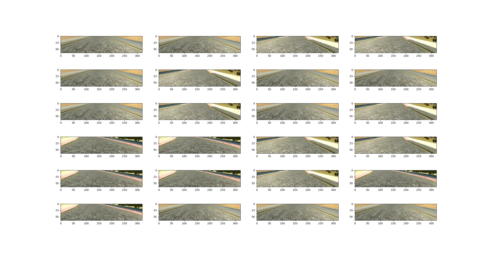
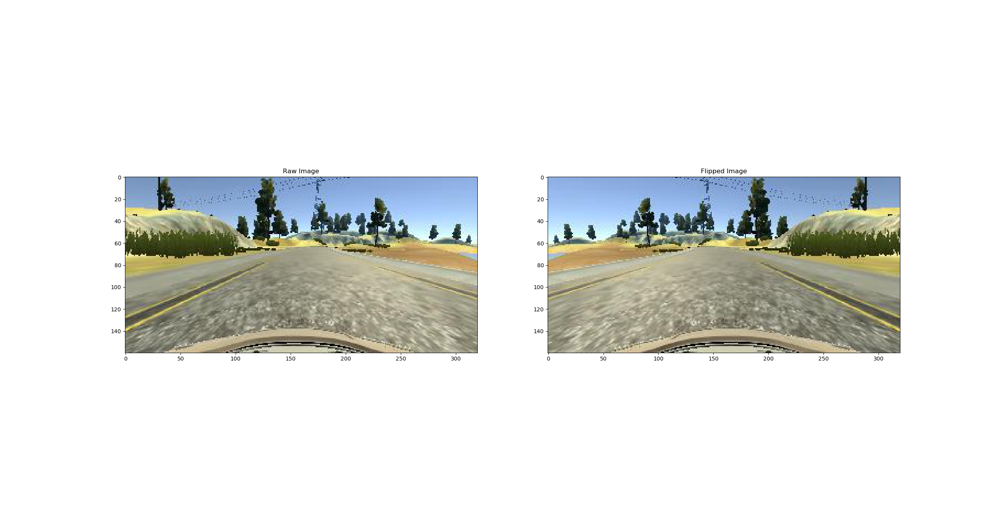

# Behavioral Cloning

The aim of this project is to train a neural network so that, given an image taken from a dash cam , 
the model is able to predict the steering angle required to maintain the car at the center of the lane. 
In an earlier project, we had taken a Computer Vision (CV) approach to achieve something similar where in, 
the lane lines were detected using CV techniqus like edge detection, perspective transforms and polynomial curve fitting. 
There were limitations to this approach. Mainly, the only feature used in this approach was human-selected (ie, lane marking). 
With such high dependency on one feature, the system could be unstable under conditions like, missing lane markings, unpaved roads or other
unclear visual guidance. 

[NVIDIA published a paper in 2016](https://images.nvidia.com/content/tegra/automotive/images/2016/solutions/pdf/end-to-end-dl-using-px.pdf) ,
where they argue that a Convolution Neural Network (CNN) based steering angle prediction is a more robust approach for end-to-end 
learning. To quote the paper 

> The system automatically learns internal representations of the necessary processing steps such as detecting useful road features with only the human steering angle
as the training signal. We never explicitly trained it to detect, for example, the outline of roads.

A diagram below shows how the learning is achieved. A CNN is fed with 3 dash cam mounted images and made to predict a steering angle. 
This predicted steering angle is compared to the desired steering angle and thier difference is accumulated as a loss function.
The model weights are updated during the process of reducing this loss function through back propagation and thus the predctions are brought closer to 
the measured values. 




## Simulator Environment

Udacity provided a simulation environment for data collection and model testing for this project. The simulator built on Unity platform
has two modes, training and autonomous mode. The training mode allows the user to drive the car around two tracks and lets you record
the images from 3 front mounted cameras along with the corresponding steering angle, throtle, brake and speed values. 

|Simulator | Training Mode|
:---------:|:------------:|
||

To generate the training data, the car was driven around the track in the forward direction for about 6 laps and in the reverse direction for about 4 laps. The idea was to make sure the model generalizes to lanes curving to either sides of the car. This gave a good enough distribution of steering angle as shown below


## Data Preprocessing and Augmentation

### Data generator
Since the number of images used to train the model to go round the track is considerably large, it becomes quite prohibitive 
to read in all the images into memory for training. This prompts us to use a generator function in python to serve batches of images
to the model for training. A generator function is one which return an object that can be iterated upon. Any function can be made 
a generator function by replacing a ```return``` statement with an ```yield``` statement. 

The 'driverlog.csv' is read in to get the image paths and the corresponding steering angles. This list is then split into train and validation sets using ```sklearn``` ```train_test_split``` function. An 80/20 split of train and validation set is thus generated. Keras' fit_generate function allows us to pass on a generator for both the train and validation sets which will then be read in batches based on the defined BATCH_SIZE. 

### Preprocessing and Augmentation

In order to make the model less sensitve to the scene lighting and texture, two preprocessing techniques are used

1. **Normalizing the image**
	Normalizing is believed to help in make the learning faster since the derivative of the weights of different features will be within the same bounds and hence one single learning rate can be used. With that being said, since all features in an image are within the [0,255] bounds,the effect of normalization was not studied in detail. I plan to take this up in a future study.
	The image is normalized using the Lambda layer in keras as shown below
	```Lambda(lambda x: (x/255.)-0.5,input_shape=(160,320,3))```
2. **Random Brightness perturbation**
	The BGR image is converted to HSV colormap and the V channel is perturbed by a random number inorder to change its brightness value.This new image is also added to the dataset to augment it with additional images representing varying lighting conditions. 
    
  
3. **Cropping the image**
	Parts of the image representing the farfield is cropped off so that the model sees less noise and learns mostly from the lane information. To achieve this the top and bottom of the image is cropped to retain only the lane information. The cropping is also achieved in batches using the Cropping2D layer in keras. 
    
4. **Flipping the image** 
	Since the car was driven in a loop it mostly takes a left turn during training. To add balance to the dataset, the images and the steering angles are flipped and the new data is added to the training and validation datasets. 
    
5. **Steering correction**
   Since the steering angle value corresponds to the center dash camera, for images from the left and the right cameras, a correction value needs to be defined. A value of 0.2 was suggested in the lecture videos. For the current model the following correction was used 

   *left steering = steering angle + 0.2*

   *right steering = steerng angle -0.3*
	
## Model Architecture

For this exercise, I chose to use the same architecture as described in the NVIDIA paper discussed above. This model consists of 
**3 layers of 5x5** convolutions with a stride of 2 and **"ELU"** activation followed by **2 layers of 3x3** convolutions. This is then connected to **3 fully connected** layers followed by the **final layer with one output neuron**. The model architecture is as shown below. To avoid overfitting, dropout layers were added between the convolutions and each of the fully connected layers. But this did seem to have an effect on the accuracy with the "mean_square_error" being slightly high for the model with dropouts. I also noticed that at very sharp turns the model was slightly going out of the lanes with the dropout layers which did seem like underfitting. In the final model, dropout layers were removed. **L2 regularization** is used for the weight reqularization for both the convolution layers and the dense layers. 

The model also uses **"Adam" optimizer** with a fixed **learning rate of 1e-4**.  The model was run for **5 EPOCHs** with each epoch having the same number of steps as the number of images in the training set. A **BATCH_SIZE of 64** was used. 


|Layer (type) |                Output Shape       |       Param #   |
|:------------------:|:------------------------------------:|:---------------------------------------------:|
|lambda_1 (Lambda)   |         (None, 160, 320, 3)   |    0         |
|cropping2d_1 (Cropping2D) |   (None, 65, 320, 3)   |     0         |
|conv2d_1 (Conv2D)     |       (None, 33, 160, 24)  |     1824      |
|elu_1 (ELU)        |          (None, 33, 160, 24)    |   0       |  
|conv2d_2 (Conv2D)    |        (None, 17, 80, 36)    |    21636     |
|elu_2 (ELU)     |             (None, 17, 80, 36)    |    0         |
|conv2d_3 (Conv2D)    |        (None, 9, 40, 48) |        43248   |  
|elu_3 (ELU)     |             (None, 9, 40, 48)   |      0         
|conv2d_4 (Conv2D)   |         (None, 9, 40, 64)  |       27712     
elu_4 (ELU)      |            (None, 9, 40, 64)   |      0         
conv2d_5 (Conv2D)     |       (None, 9, 40, 64)     |    36928     
elu_5 (ELU)       |           (None, 9, 40, 64)     |    0         
flatten_1 (Flatten)    |      (None, 23040)   |          0         
dense_1 (Dense)     |         (None, 100)     |          2304100   
elu_6 (ELU)          |        (None, 100)          |     0         
dense_2 (Dense)    |          (None, 50)       |         5050      
elu_7 (ELU)        |          (None, 50)      |          0         
dense_3 (Dense)    |          (None, 10)       |         510       
elu_8 (ELU)        |          (None, 10)        |        0         
dense_4 (Dense)     |         (None, 1)      |           11        

## Autonomous mode

To drive the model in autonomous mode the following command was used

```python drive.py model.h5```

The trained model was successful in driving between the lanes throughout the track. 


## Donkey Car


The Donkey Car project is an open source DIY project which also uses the Behavioral Cloning technique to make an RC car g round a track that it was trained on. The link below is of a Donkey Car trained using a similar CNN as implemented in this writeup.

[Donkey Car](https://www.youtube.com/watch?v=TNJVmyCh8Uw&feature=youtu.be)

## Files Uploaded

1.[model_fwd_bkwd.py](https://github.com/srikanthadya/CarND-Behavioral-Cloning-P3/blob/master/model_fwd_bkwd.py)

2.[drive.py](https://github.com/srikanthadya/CarND-Behavioral-Cloning-P3/blob/master/drive.py)

3.[model_fwd_bkwd.h5](https://github.com/srikanthadya/CarND-Behavioral-Cloning-P3/blob/master/model_fwd_bkwd.h5)

4.[writeup.md](https://github.com/srikanthadya/CarND-Behavioral-Cloning-P3/blob/master/writeup.md)

5.[video](https://github.com/srikanthadya/CarND-Behavioral-Cloning-P3/blob/master/Autonomous_Mode.mp4)

